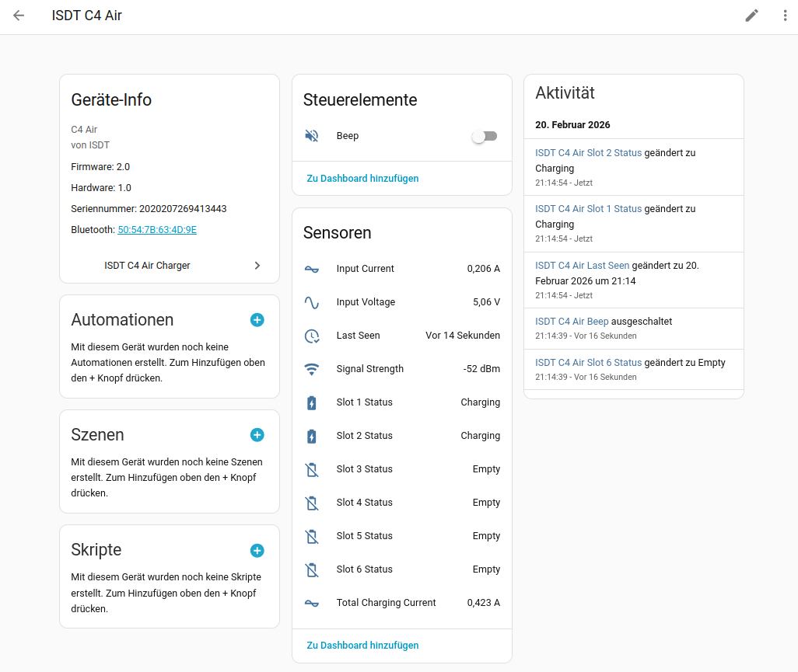
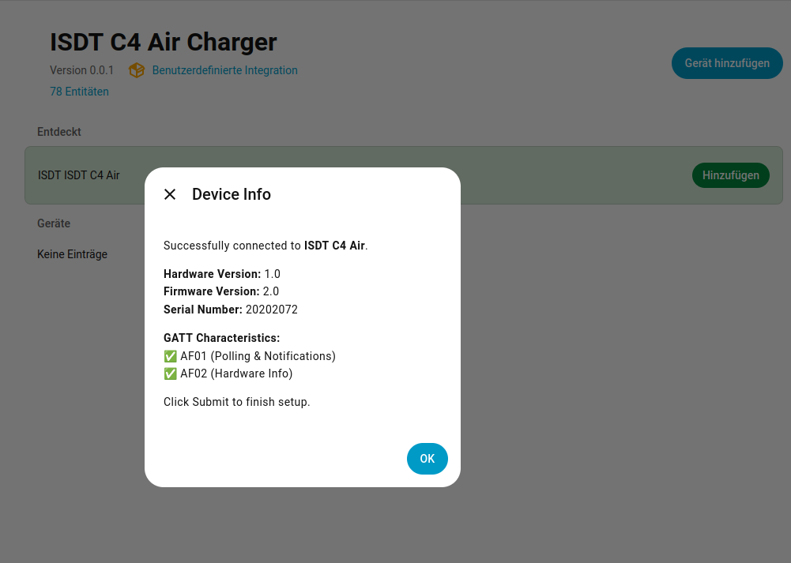
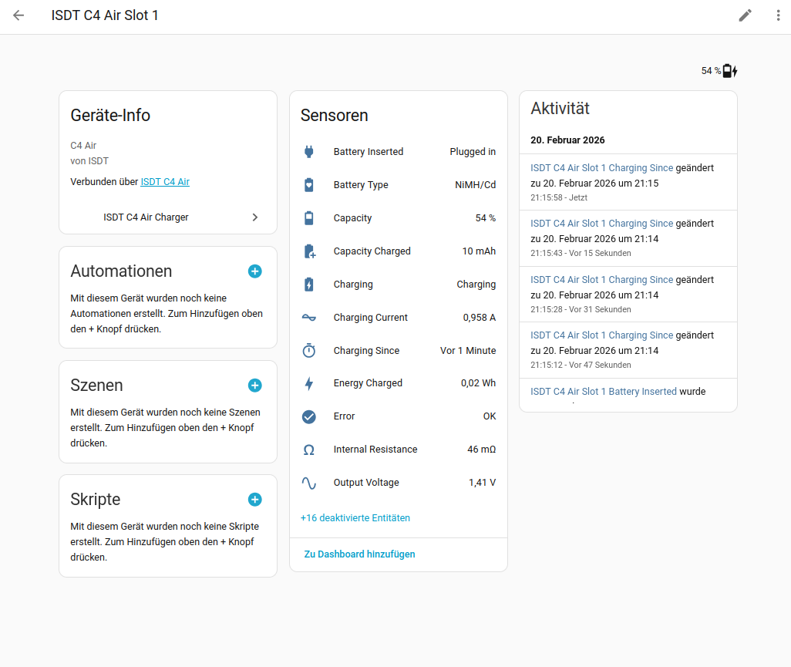

# ISDT Air BLE – Home Assistant Integration

Custom Home Assistant integration for **ISDT chargers** with Bluetooth Low Energy (BLE) connectivity. Communicates directly with the charger via a persistent BLE connection — no cloud, no app required.

## Lovelace Card

A matching dashboard card is available: **[ISDT Charger Card](https://github.com/mtheli/isdt_air_card)** — battery-style slots with live charge timer, connection indicator, and full HA theme support.

## Supported Devices

> **Note:** This integration has only been tested with the **ISDT C4 Air**. Other ISDT devices with BLE support may work but are untested.

| Model | Status |
|-------|--------|
| ISDT C4 Air | Tested |
| ISDT NP2 Air | Untested |
| ISDT LP2 Air | Untested |
| ISDT K4 | Untested |
| ISDT 608PD | Untested |

The integration auto-detects the device model from BLE manufacturer data. Other ISDT devices using the same BLE protocol may also work — feedback and reports are welcome.

## Features

- **Auto-discovery** via Bluetooth — the charger appears automatically in Home Assistant
- **Persistent BLE connection** with automatic reconnect
- **6 independent slot sub-devices** with detailed per-slot sensors
- **Live charge timer** using timestamp-based tracking (updates in real-time in the frontend)
- **Hardware info** — firmware version, hardware version, serial number in the device registry
- **Configurable poll interval** (10–300 seconds) via options flow

### Sensors

**Main device:**

| Sensor | Type | Description |
|--------|------|-------------|
| Connected | Binary (Connectivity) | BLE connection active |
| Input Voltage | Voltage (V) | Power supply voltage |
| Input Current | Current (A) | Total input current |
| Total Charging Current | Current (A) | Sum of all slot currents |
| Slot 1–6 Status | Enum | `empty`, `idle`, `charging`, `done`, `error` |
| Signal Strength | RSSI (dBm) | BLE signal strength (disabled by default) |

**Per slot (sub-device):**

| Sensor | Type | Description |
|--------|------|-------------|
| Charging | Binary (Charging) | Whether the slot is actively charging |
| Battery Inserted | Binary (Plug) | Whether a battery is present in the slot |
| Error | Binary (Problem) | Whether the slot has a charging error |
| Output Voltage | Voltage (V) | Slot output voltage |
| Charging Current | Current (A) | Slot charging current |
| Capacity | Battery (%) | Current charge level |
| Capacity Charged | mAh | Charged capacity in current session |
| Energy Charged | Energy (Wh) | Charged energy in current session |
| Charging Since | Timestamp | Charge start time (live-updating) |
| Battery Type | Text | Detected chemistry (LiPo, NiMH, LiFe, etc.) |
| Internal Resistance | mOhm | Battery internal resistance |
| Cell 1–16 Voltage | Voltage (V) | Individual cell voltages (disabled by default) |

### Switch

| Entity | Description |
|--------|-------------|
| Beep | Toggle the charger alarm/beep tone |

## Screenshots

| Config Flow | Device Overview | Slot Detail |
|:-----------:|:---------------:|:-----------:|
|  |  |  |

## Installation

### HACS (recommended)

1. Open HACS in Home Assistant
2. Go to **Integrations** → **...** (top right) → **Custom repositories**
3. Add `https://github.com/mtheli/isdt_air_ble` as **Integration**
4. Search for "ISDT" and install
5. Restart Home Assistant

### Manual

1. Copy the `custom_components/isdt_air_ble` folder into your Home Assistant `config/custom_components/` directory
2. Restart Home Assistant

## Setup

1. Make sure your Home Assistant has a Bluetooth adapter (built-in or USB)
2. Power on your ISDT charger
3. The charger should be auto-discovered — check **Settings → Devices & Services → Discovered**
4. Click **Configure** and confirm

## Configuration

After setup, you can adjust the **poll interval** via the integration options:

1. Go to **Settings → Devices & Services**
2. Find the ISDT charger entry
3. Click **Configure**
4. Set the poll interval (default: 10 seconds, range: 10–300)

## BLE Protocol

The integration communicates directly via BLE — no cloud, no account required. All communication is fully local.

The charger uses a single GATT service with two characteristics:

- **AF01** – Data polling via continuous command cycling (workstate, electric, IR, alarm tone)
- **AF02** – Bind handshake and hardware info query (once after connect, before polling)

For a detailed technical description of the BLE protocol including packet formats, command reference, and timing, see [PROTOCOL.md](PROTOCOL.md).

## License

[MIT](LICENSE)
