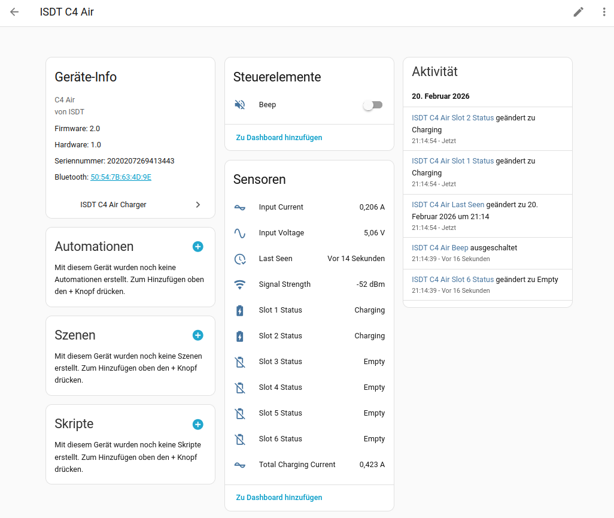
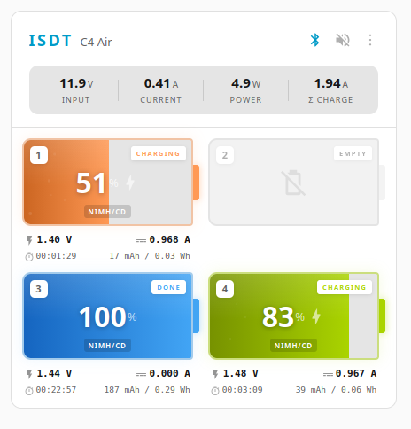
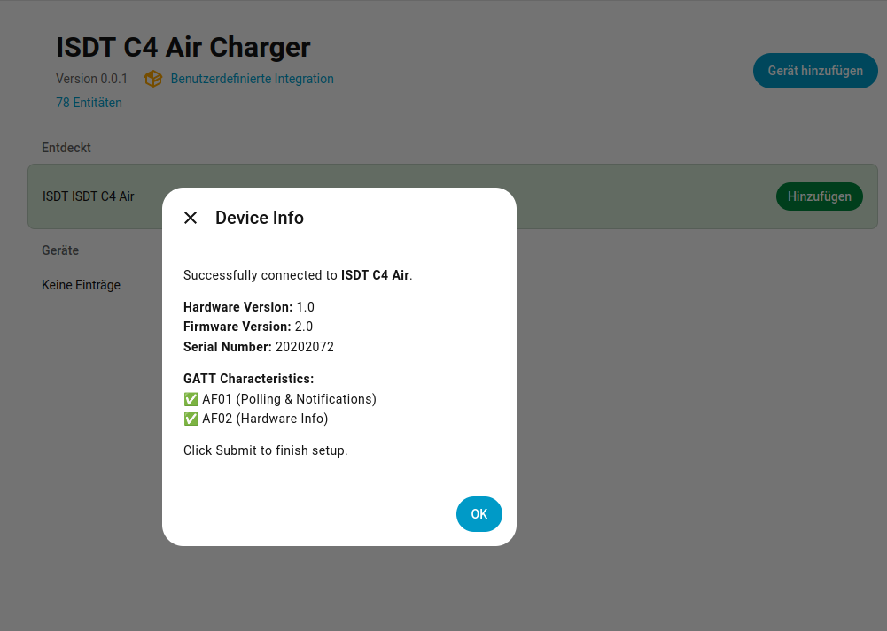
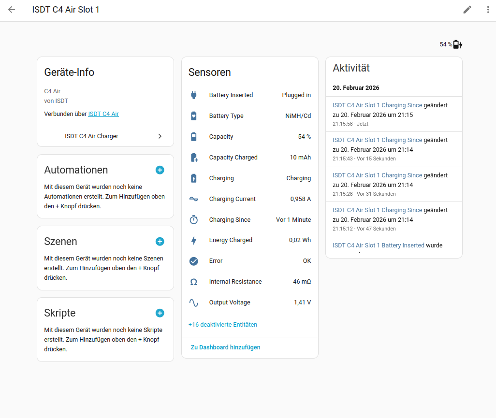

# ISDT Air BLE – Home Assistant Integration

Custom Home Assistant integration for **ISDT chargers** and the **MASS2** USB power adapter with Bluetooth Low Energy (BLE) connectivity. Communicates directly with the device via a persistent BLE connection — no cloud, no app required.

## Lovelace Card

A matching dashboard card is available: **[ISDT Charger Card](https://github.com/mtheli/isdt_air_card)** — battery-style slots with live charge timer, connection indicator, and full HA theme support.

## Supported Devices

> **Note:** This integration has been tested with the **ISDT C4 Air** (charger) and the **ISDT MASS2** (USB power adapter). Other ISDT devices with BLE support may work but are untested.

| Model | Type | Status |
|-------|------|--------|
| ISDT C4 Air | Charger | Tested |
| ISDT MASS2 | USB Adapter | Tested |
| ISDT NP2 Air | Charger | Untested |
| ISDT LP2 Air | Charger | Untested |
| ISDT K4 | Charger | Untested |
| ISDT 608PD | Charger | Untested |

The integration auto-detects the device model from BLE manufacturer data and exposes the appropriate entities (6 slot sub-devices for chargers, 8 USB port sub-devices for the MASS2). Other ISDT devices using the same BLE protocol may also work — feedback and reports are welcome.

## Features

- **Auto-discovery** via Bluetooth — the device appears automatically in Home Assistant
- **One-time pairing** — the bind UUID is stored in the config entry, so the device recognises Home Assistant across restarts (no repeated button presses)
- **Persistent BLE connection** with automatic reconnect
- **Slot / port sub-devices** with detailed per-slot or per-port sensors (6 slots for chargers, 8 USB ports for MASS2)
- **Live charge timer** (chargers) using timestamp-based tracking — updates in real-time in the frontend
- **Hardware info** — firmware version, hardware version, serial number in the device registry
- **Configurable poll interval** (3–300 seconds) via options flow

### Chargers (C4 Air etc.)

**Main device:**

| Sensor | Type | Description |
|--------|------|-------------|
| Connected | Binary (Connectivity) | BLE connection active |
| Input Voltage | Voltage (V) | Power supply voltage |
| Input Current | Current (A) | Total input current |
| Total Charging Current | Current (A) | Sum of all slot currents |
| Slot 1–6 Status | Enum | `empty`, `idle`, `charging`, `done`, `error` |
| Signal Strength | RSSI (dBm) | BLE signal strength (disabled by default) |
| Beep | Switch | Toggle the charger alarm/beep tone |

**Per slot (sub-device):**

| Sensor | Type | Description |
|--------|------|-------------|
| Charging | Binary (Charging) | Whether the slot is actively charging |
| Battery Inserted | Binary (Plug) | Whether a battery is present in the slot |
| Error | Binary (Problem) | Whether the slot has a charging error |
| Output Voltage | Voltage (V) | Slot output voltage |
| Charging Current | Current (A) | Slot charging current |
| Capacity | Battery (%) | Current charge level |
| Capacity Charged | mAh | Charged capacity in current session |
| Energy Charged | Energy (Wh) | Charged energy in current session |
| Charging Since | Timestamp | Charge start time (live-updating) |
| Battery Type | Text | Detected chemistry (LiPo, NiMH, LiFe, etc.) |
| Internal Resistance | mOhm | Battery internal resistance |
| Cell 1–16 Voltage | Voltage (V) | Individual cell voltages (disabled by default) |

### MASS2 USB Adapter

**Main device:**

| Entity | Type | Description |
|--------|------|-------------|
| Connected | Binary (Connectivity) | BLE connection active |
| Total Power | Power (W) | Sum of all port power draw |
| USB-C1…C6 / USB-A1–A2 Status | Enum | `off`, `idle`, `active` |
| Signal Strength | RSSI (dBm) | BLE signal strength (disabled by default) |
| Beep | Switch | Toggle the buzzer for USB events |
| Volume | Select | Buzzer volume — low / medium / high |

**Per USB port (sub-device):**

| Sensor | Type | Description |
|--------|------|-------------|
| Active | Binary (Power) | Whether the port is delivering power |
| Voltage | Voltage (V) | Output voltage |
| Current | Current (A) | Output current |
| Power | Power (W) | Current power draw |
| Protocol | Enum | Charging protocol (`None`, `USB PD`, `Fast Charge`) |

## Screenshots

| Config Flow | Device Overview | Slot Detail |
|:-----------:|:---------------:|:-----------:|
|  |  |  |

## Installation

### HACS (recommended)

1. Open HACS in Home Assistant
2. Go to **Integrations** → **...** (top right) → **Custom repositories**
3. Add `https://github.com/mtheli/isdt_air_ble` as **Integration**
4. Search for "ISDT" and install
5. Restart Home Assistant

### Manual

1. Copy the `custom_components/isdt_air_ble` folder into your Home Assistant `config/custom_components/` directory
2. Restart Home Assistant

## Setup

1. Make sure your Home Assistant has a Bluetooth adapter (built-in or USB)
2. Power on your ISDT device
3. It should be auto-discovered — check **Settings → Devices & Services → Discovered**
4. Click **Configure** and follow the pairing prompt — press any button on the device within 30 seconds to confirm pairing (the MASS2 will beep, chargers wait silently). After the first pairing, subsequent reconnects are silent.

## Configuration

After setup, you can adjust the **poll interval** via the integration options:

1. Go to **Settings → Devices & Services**
2. Find the ISDT device entry
3. Click **Configure**
4. Set the poll interval (default: 5 seconds, range: 3–300)

## BLE Protocol

The integration communicates directly via BLE — no cloud, no account required. All communication is fully local.

Both chargers and the MASS2 adapter use a single GATT service with two characteristics:

- **AF01** – Data polling via continuous command cycling (charger: workstate, electric, IR, alarm tone; MASS2: port status, settings)
- **AF02** – Bind handshake and hardware info query (once after connect, before polling)

Chargers run a 19-command cycle (1 alarm-tone + 6 channels × 3 commands) at 100 ms intervals. The MASS2 uses a single WorkStatus poll per cycle. BLE notifications for the MASS2 are reassembled across fragments to handle the default 23-byte ATT MTU correctly.

For a detailed technical description of the BLE protocol including packet formats, command reference, and timing, see [PROTOCOL.md](PROTOCOL.md).

## Disclaimer

This is an independent community project and is not affiliated with, endorsed by, or sponsored by ISDT. All product names, trademarks, and registered trademarks are property of their respective owners.

## License

[MIT](LICENSE)
